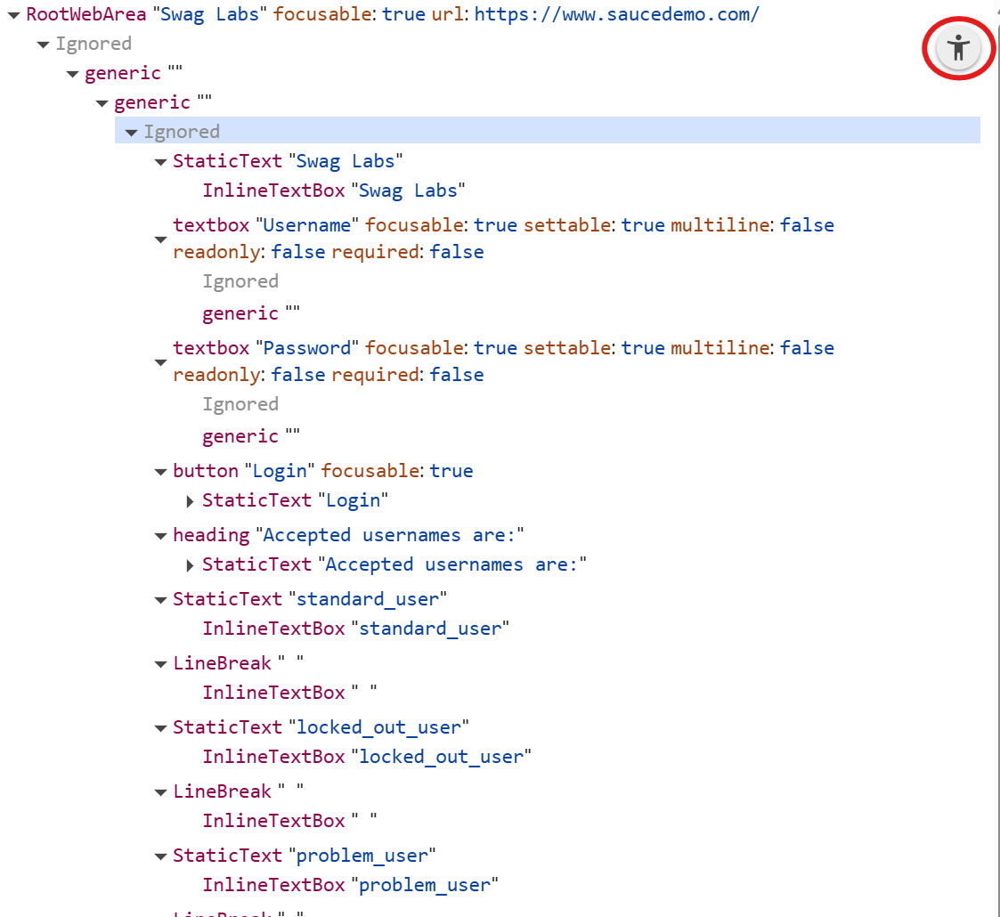

# E2E Tests en el frontend

- [E2E Tests en el frontend](#e2e-tests-en-el-frontend)
  - [Tests E2E con Playwright](#tests-e2e-con-playwright)
    - [Instalación de Playwright](#instalación-de-playwright)
      - [Ejecución y prueba de la instalación](#ejecución-y-prueba-de-la-instalación)
      - [Report de pruebas](#report-de-pruebas)
      - [Configuraciones adicionales](#configuraciones-adicionales)
    - [Uso de Playwright: creación de tests](#uso-de-playwright-creación-de-tests)
      - [Localizadores](#localizadores)
        - [Localizadores modernos](#localizadores-modernos)
        - [Roles de accesibilidad](#roles-de-accesibilidad)
        - [Localizadores legacy](#localizadores-legacy)
      - [Aserciones (assertions)](#aserciones-assertions)
      - [🧿Ejemplo: test de Home Page de Practice Software Testing](#ejemplo-test-de-home-page-de-practice-software-testing)
      - [Credenciales del usuario (auth credentials)](#credenciales-del-usuario-auth-credentials)
    - [Tests de un API](#tests-de-un-api)
      - [🧿Ejemplo: test de la API de Practice Software Testing](#ejemplo-test-de-la-api-de-practice-software-testing)
    - [Herramienta Codegen para la generación automática de tests](#herramienta-codegen-para-la-generación-automática-de-tests)
    - [Tests de accesibilidad](#tests-de-accesibilidad)
    - [Tests de navegación basada en teclado](#tests-de-navegación-basada-en-teclado)
      - [Matchers y aserciones de accesibilidad](#matchers-y-aserciones-de-accesibilidad)
      - [Tests de accesibilidad con axe-core](#tests-de-accesibilidad-con-axe-core)

Los test de extremo a extremo (E2E) son una parte fundamental de la estrategia de pruebas de cualquier aplicación, ya que permiten validar el comportamiento de la aplicación en su conjunto, desde la perspectiva del usuario final. En el caso de las aplicaciones web, los test E2E se utilizan para simular la interacción del usuario con la interfaz gráfica, comprobando que las acciones del usuario producen los resultados esperados.

Para ello se utilizan diversas herramientas que permiten automatizar la interacción con la aplicación, simulando el comportamiento del usuario y validando los resultados obtenidos. Entre las herramientas más populares para realizar test E2E en aplicaciones web se encuentran [Cypress](https://www.cypress.io/), la combinación de [Puppeteer](https://pptr.dev/) Jest y más recientemente, [Playwright](https://playwright.dev/). En nuestro caso veremos cómo realizar test E2E en una aplicación web utilizando la herramienta Playwright.

## Tests E2E con Playwright

Playwright es una herramienta de automatización de pruebas de código abierto desarrollada por **Microsoft** que permite realizar pruebas E2E en aplicaciones web. Playwright es compatible con múltiples navegadores (Chromium, Firefox y WebKit) y ofrece una API sencilla y potente para interactuar con la aplicación web.

[Evolución de herramientas e2e en npm](https://npmtrends.com/cypress-vs-playwright-vs-puppeteer-vs-selenium-webdriver-vs-webdriverio)

### Instalación de Playwright

Para instalar Playwright en nuestro proyecto o crear uno nuevo, podemos utilizar npm o yarn. A continuación se muestra cómo instalar Playwright utilizando npm:

```shell
npm init playwright@latest <nombre-del-proyecto>
```

Si no se indica la carpeta del proyecto, se utilizará la carpeta actual.

Cuando se le solicite, seleccionamos/confirmamos:

- TypeScript o JavaScript (predeterminado: TypeScript) - No se pregunta si el proyecto ya tiene un package.json
- Nombre de la carpeta de pruebas (predeterminado: tests, o e2e si tests ya existe)
- Agregar un flujo de trabajo de GitHub Actions (recomendado para CI)
- Instalar navegadores Playwright (predeterminado: sí) - Instala Chromium, Firefox y WebKit

El resultado de la instalación es es siguiente estructura de carpetas:

```shell
playwright.config.ts         # Test configuration
package.json
package-lock.json            # Or yarn.lock / pnpm-lock.yaml
tests/
  example.spec.ts            # Minimal example test
```

#### Ejecución y prueba de la instalación

Para ejecutar las pruebas de ejemplo y verificar que Playwright se ha instalado correctamente, podemos utilizar el siguiente comando:

```shell
npx playwright test
```

Algunas modificaciones de este comando que podemos probar ahora son:

- Ver la ventana del navegador: agregar `--headed`.
- Ejecutar un solo proyecto/navegador: `--project=chromium`.
- Ejecute un archivo: `npx playwright test example`.
- Ejecutar en modo debug: `--debug`.
- Autogenerar los tests: `npx playwright codegen`.
- Interfaz de usuario interactivo: `--ui`.

Esta última opción abre una **interfaz gráfica** que permite ejecutar y depurar las pruebas de manera interactiva. Es probablemente la forma más cómoda de trabajar con Playwright durante el desarrollo de las pruebas.

En esta interfaz veremos los test, pero no se ejecutarán hasta que se lo indiquemos (botón play). Al ejecutar un test, veremos el resultado en la interfaz, incluyendo los resultados en el panel correspondiente al navegador para cada una de las etapas de la prueba.

Lo habitual sera añadir scripts en el package.json para facilitar la ejecución de los tests:

```json
"scripts": {
  "e2e:dev": "playwright test --project=chromium --ui",
  "e2e:headed": "playwright test --headed",
  "e2e": "playwright test"
}
```

#### Report de pruebas

Playwright genera reportes de las pruebas ejecutadas, incluyendo capturas de pantalla, videos y trazas de las pruebas. Estos reportes son útiles para analizar los resultados de las pruebas y depurar posibles errores. Para ver el reporte HTML de las pruebas, podemos utilizar el siguiente comando:

```shell
npx playwright show-report
```

#### Configuraciones adicionales

En el archivo `playwright.config.ts` podemos configurar diversas opciones para las pruebas, como el tiempo de espera, la configuración del navegador, la configuración de la red, entre otras. A continuación se muestra un ejemplo de configuración básica:

```typescript
// playwright.config.ts
import { defineConfig, devices } from '@playwright/test';

export default defineConfig({
  timeout: 30_000,
  globalTimeout: 600_000,
  expect: {
    timeout: 5_000,
  },
  use: {
    /* Base URL to use in actions like `await page.goto('')`. */
    // baseURL: 'http://localhost:3000',

    /* Collect trace when retrying the failed test. See https://playwright.dev/docs/trace-viewer */
    trace: 'on',
    actionTimeout: 0,
    ignoreHTTPSErrors: true,
    video: 'retain-on-failure',
    screenshot: 'only-on-failure',
  },
  projects: [
    {
      name: 'desktop-chrome',
      use: { ...devices['Desktop Chrome'] },
    },
    {
      name: 'desktop-firefox',
      use: { ...devices['Desktop Firefox'] },
    },
    {
      name: 'desktop-safari',
      use: { ...devices['Desktop Safari'] },
    },
  ],
});
```

Si el proyecto corresponde a una url, se la indicaremos en la propiedad `baseURL`.

Podría ser una url local, como `http://localhost:4200` o una url remota, como `https://mi-aplicacion.com`.

Algunas páginas disponibles para poder llevar a cabo pruebas son:

- [Practice Software Testing](https://practicesoftwaretesting.com/) by Roy de Kleijn (Testsmith)
- [OpenCart](https://opencart.abstracta.us/)
- [Sauce Demo](https://www.saucedemo.com/)

Para la primera de ellas, la configuración de `use` sería la siguiente:

```typescript
// playwright.config.ts
  use: {
    baseURL: "https://practicesoftwaretesting.com",
    testIdAttribute: "data-test",
  }
```

Para definir un setup para todas las pruebas, podemos crear un archivo y definirlo como un proyecto (luego veremos su uso), creando luego una dependencia en los proyectos que lo necesiten:

```typescript
// playwright.config.ts
  projects: [
    {
      name: 'setup',
      testDir: './',
      testMatch: /.*\.setup\.ts/,
    },
    {
      name: "chromium",
      dependencies: ["setup"],
      use: { ...devices["Desktop Chrome"], permissions: ["clipboard-read"] },
    },
  ],
```

Trabajando en local (Angular, React..) se suele activar la última opción del apartado de `webServer` para iniciar el servidor de desarrollo antes de ejecutar las pruebas:

```typescript
// playwright.config.ts
  webServer: {
    command: 'npm start',
    port: 4200,
    reuseExistingServer: !process.env.CI,
  },
```

### Uso de Playwright: creación de tests

Para crear tests con Playwright, podemos utilizar la API proporcionada por la herramienta para interactuar con la aplicación web y validar los resultados obtenidos. A continuación se muestra un ejemplo básico de un test E2E utilizando Playwright:

```typescript
import { test, expect } from '@playwright/test';

test.describe('Pruebas básicas con Playwright', () => {
  test('test básico', async ({ page }) => {
    await page.goto('https://practicesoftwaretesting.com');
    expect(await page.title()).toBe('Practice Software Testing');
  });
});
```

Playwright proporciona dos objetos principales para crear los tests: `test` y `expect`.

El objeto `test` se utiliza

- definir una suite de pruebas con `test.describe()`,
- definir cada test con `test()`

Dentro de la función del test,

- recibe como parámetro el objeto `page` que se utiliza para interactuar con la página web, como navegar a una URL con `page.goto()`.
- el objeto `expect` se utiliza para validar los resultados obtenidos, como verificar el título de la página con `expect(page.title).toBe()`. Siempre es asíncrono, por lo que hay que usar `await` para obtener el valor.

#### Localizadores

Playwright utiliza localizadores para identificar y seleccionar elementos en la página web. Los localizadores son una forma de describir cómo encontrar un elemento en el DOM (Document Object Model) de la página. Playwright proporciona localizadores legacy, como selectores CSS 0 XPath, junto con localizadores modernos, muy similares a los existentes en bibliotecas como Testing Library.

##### Localizadores modernos

Los localizadores modernos son más robustos y fáciles de usar, ya que se basan en atributos accesibles y roles de ARIA. Algunos ejemplos de localizadores modernos son:

- `getByRole`
- `getByText`
- `getByLabel`
- `getByPlaceholder`
- `getByAltText`
- `getByTitle`
- `getByTestId`

Estos localizadores permiten definir dos estrategias de selección diferentes:

- En función de la accesibilidad de los elementos (roles, labels, etc.)
- En función de ids específicos para testing (data-test-id u otro atributo personalizado, que se puede definir en la configuración)

##### Roles de accesibilidad

Son uno de los elementos clave de los localizadores modernos. Los roles de accesibilidad son atributos que describen la función de un elemento en la interfaz de usuario, como un botón, un enlace o un cuadro de texto. Playwright utiliza estos roles para identificar y seleccionar elementos en la página web.

Estos roles pueden ser

- intrínsecos (definidos por el propio HTML); por ejemplo, un `<button>` tiene el rol de **"button"** de forma predeterminada, o un `<a>` con atributo `href` tiene el rol de **"link"**. Los roles de cada elemento HTML se pueden consultar en la [especificación de roles de WAI-ARIA](https://www.w3.org/TR/wai-aria-1.2/#role_definitions) o en la página del elemento en [MDN](https://developer.mozilla.org/en-US/docs/Web/HTML/Element).

- explícitos (definidos mediante atributos ARIA), como `role="button"` o `role="navigation"`.

Además cada elemento con un rolo puede tener atributos de accesibilidad adicionales que proporcionan más información sobre el elemento, como `name`, `pressed`, `expanded`, etc. El `name` es especialmente importante, ya que se utiliza para identificar el elemento en los localizadores modernos. Depende de cada rol, pero generalmente se deriva del texto visible del elemento o de atributos como `aria-label` o `aria-labelledby`.

Por ejemplo, para seleccionar un botón con el texto "Enviar", podemos utilizar el siguiente localizador:

```typescript
const sendButton = page.getByRole('button', { name: 'Enviar' });
```

##### Localizadores legacy

Además de los localizadores modernos, Playwright también admite localizadores legacy basados en selectores CSS y XPath. Estos localizadores son útiles cuando no se pueden utilizar los localizadores modernos, pero se recomienda utilizar los modernos siempre que sea posible.

- **selectores CSS**: sigue la sintaxis estándar de CSS para seleccionar elementos en la página web por id, por clase, por atributo o mediante selectores combinados, que utilizan diversos operadores además de pseudo-clases y pseudo-elementos. Por ejemplo, para seleccionar un elemento con la clase "mi-clase", podemos utilizar el siguiente localizador:

```typescript
const miElemento = page.locator('.mi-clase');
```

- **expresiones XPath**: utiliza la sintaxis estándar de XPath para seleccionar elementos en la página web mediante rutas y expresiones XPath. Por ejemplo, para seleccionar un elemento `<div>` con un atributo `data-test-id` igual a "mi-elemento", podemos utilizar el siguiente localizador:

```typescript
const miElemento = page.locator('//div[@data-test-id="mi-elemento"]');
```

Una manera de probar XPath es utilizando la función `$x()` en la consola de herramientas de desarrollo del navegador.Esta función te permite evaluar una expresión XPath y devuelve un array de los elementos del DOM que coinciden con la expresión.

En XPath, `//` se utiliza para seleccionar elementos en cualquier lugar del documento. Por tanto, al ejecutar $x("//") la consola devuelve un array con todos los elementos del DOM de la página web actual.

Es una forma rápida y útil de seleccionar elementos usando expresiones XPath. Por ejemplo, si escribes $x("//p") en la consola, obtendrás un array con todos los elementos \<p> (párrafo) de la página.

#### Aserciones (assertions)

Playwright proporciona una serie de aserciones (assertions) que permiten validar los resultados obtenidos en las pruebas. Estas aserciones se utilizan junto con el objeto `expect` para verificar que los elementos de la página web cumplen con ciertas condiciones. Se pueden dividir en dos categorías:

- Aserciones de estado (locator assertions): permiten verificar el estado de un elemento en la página web, como si está visible, habilitado, seleccionado, entre otros. Algunos ejemplos de aserciones de estado son:

  - `toBeVisible()`
  - `toBeHidden()`
  - `toBeEnabled()`
  - `toBeDisabled()`
  - `toBeChecked()`
  - `toBeUnchecked()`

Cuando estas aserciones fallan, se reintentan automáticamente durante un período de tiempo configurado (por defecto 5 segundos), lo que ayuda a manejar situaciones en las que el estado del elemento puede cambiar dinámicamente.

Algunos ejemplos de uso de aserciones de estado son:

```typescript
await page.goto('https://practicesoftwaretesting.com/formulario');
await expect(page).toHaveURL(/.*formulario/);
const button = page.getByRole('button', { name: 'Enviar' });
await expect(button).toBeVisible();
await expect(button).toBeEnabled();
```

- Aserciones de valor (value assertions): permiten verificar el valor de un elemento en la página web, como el texto, el atributo, el valor del campo, entre otros. Algunos ejemplos de aserciones de valor son:

  - `toHaveText()`
  - `toHaveAttribute()`
  - `toHaveValue()`
  - `toHaveClass()`
  - `toHaveCount()`

Estas aserciones no se reintentan automáticamente, sino que se evalúan una única vez. Si el valor del elemento puede cambiar dinámicamente, es recomendable utilizar las aserciones de estado para esperar a que el elemento esté en el estado esperado antes de verificar su valor.

Algunos ejemplos de uso de aserciones de valor son:

```typescript
const message = page.getByTestId('message');
await expect(message).toHaveText('Operación exitosa');
await expect(message).toHaveClass(/success/);
```

#### 🧿Ejemplo: test de Home Page de Practice Software Testing

Veamos un ejemplo completo de un test E2E utilizando Playwright para validar la página de inicio de [Practice Software Testing](https://practicesoftwaretesting.com/). En este ejemplo, se realizan varias validaciones en la página

- verificar el título
- la presencia de elementos (login)
- funcionalidad de búsqueda: buscar un producto y validar que aparecen resultados

```typescript
import { test, expect } from '@playwright/test';

test.describe('Home page with no auth', () => {
  test.beforeEach(async ({ page }) => {
    await page.goto('https://practicesoftwaretesting.com/');
  });

  test('check sign in', async ({ page }) => {
    await expect(page.getByTestId('nav-sign-in')).toHaveText('Sign in');
  });

  test('validate page title', async ({ page }) => {
    await expect(page).toHaveTitle(
      'Practice Software Testing - Toolshop - v5.0'
    );
  });

  test('grid loads with 9 items', async ({ page }) => {
    const productGrid = page.locator('.col-md-9');
    await expect(productGrid.getByRole('link')).toHaveCount(9);
    expect(await productGrid.getByRole('link').count()).toBe(9);
  });

  test('search for Thor Hammer', async ({ page }) => {
    const productGrid = page.locator('.col-md-9');
    await page.getByTestId('search-query').fill('Thor Hammer');
    await page.getByTestId('search-submit').click();
    await expect(productGrid.getByRole('link')).toHaveCount(1);
    await expect(page.getByAltText('Thor Hammer')).toBeVisible();
  });
});
```

#### Credenciales del usuario (auth credentials)

Una operación que podríamos testar es la posibilidad de iniciar sesión en la aplicación web. Para ello, necesitaríamos disponer de unas credenciales válidas (usuario y contraseña) para poder realizar el test de autenticación. En el repositorio de [Practice Software Testing](https://github.com/testsmith-io/practice-software-testing) se proporcionan unas credenciales de prueba que podemos utilizar.

Utilizaremos las siguientes credenciales:

- mail: `customer@practicesoftwaretesting.com`
- Contraseña: `welcome01`
- Usuario: `Jane Doe`
- Role: `user`

En lugar de un test normal, crearemos un `setup` que nos permita reutilizar el código de autenticación en varios tests.
Crearemos un archivo `auth.setup.ts` con el siguiente contenido:

```typescript
import { test as setup, expect } from '@playwright/test';

setup('Create customer 01 auth', async ({ page, context }) => {
  const email = 'customer@practicesoftwaretesting.com';
  const password = 'welcome01';
  const customer01AuthFile = '.auth/customer01.json';

  await page.goto('https://practicesoftwaretesting.com/auth/login');

  await page.getByTestId('email').fill(email);
  await page.getByTestId('password').fill(password);
  await page.getByTestId('login-submit').click();

  await expect(page.getByTestId('nav-menu')).toContainText('Jane Doe');
  await context.storageState({ path: customer01AuthFile });
});
```

Para que esto funcione es imprescindible haberlo definido en la configuración de Playwright como un proyecto de setup, tal y como vimos anteriormente.

En el fichero `.auth/customer01.json` estaremos guardando el estado de autenticación del usuario, incluyendo cookies y almacenamiento local (localStorage), una vez que se ha iniciado sesión correctamente. La primera vez que ejecutemos este setup, se realizará el proceso de login y se guardarán las credenciales en el archivo indicado. (Puede que el resto de los test fallen esta vez). El archivo de estado de autenticación, debe estar en el `.gitignore` para evitar subirlo al repositorio.

Una vez creado el archivo de estado de autenticación, ya no será necesario volver a iniciar sesión en cada test, ya que Playwright podrá reutilizar las credenciales de autenticación en otros tests mediante el comando `test.use({ storageState: '.auth/customer01.json' })`. Así lo hacemos en el siguiente test:

```typescript
test.describe('Home page customer 01 auth', () => {
  test.use({ storageState: '.auth/customer01.json' });
  test.beforeEach(async ({ page }) => {
    await page.goto('https://practicesoftwaretesting.com/');
  });

  test('check customer 01 is signed in', async ({ page }) => {
    await expect(page.getByTestId('nav-sign-in')).not.toBeVisible();
    await expect(page.getByTestId('nav-menu')).toContainText('Jane Doe');
  });
});
```

### Tests de un API

Playwright también permite realizar pruebas de APIs mediante su módulo `APIRequestContext`. Este módulo proporciona una forma sencilla de enviar solicitudes HTTP y validar las respuestas obtenidas. A continuación se muestra un ejemplo básico de un test de API utilizando Playwright:

```typescript
import { test, expect } from '@playwright/test';

test('GET /api/customers', async ({ request }) => {
  const response = await request.get('/api/customers');
  expect(response.status()).toBe(200);
  expect(await response.json()).toEqual(
    expect.arrayContaining([expect.objectContaining({ id: 1 })])
  );
});
```

En este caso, el callback del test recibe como parámetro el objeto `request` que se utiliza para enviar solicitudes HTTP, como una solicitud GET a la URL `/api/customers` con `request.get()`.

Las request a la API devuelven un objeto definido por el interface `APIResponse`, que contiene información sobre la respuesta obtenida, como el código de estado, los encabezados y el cuerpo de la respuesta. En cierto modo similar a la interfaz `Response` de la API Fetch.

Luego, se utiliza el objeto `expect` para validar la respuesta obtenida:

- verificar el código de estado con `expect(response.status()).toBe(200)`
- comprobar el contenido de la respuesta, convirtiendo el stream (buffer) de datos a JSON con `expect(response.json()).toEqual()`.

#### 🧿Ejemplo: test de la API de Practice Software Testing

Veamos un ejemplo completo de un test E2E utilizando Playwright para validar la API de [Practice Software Testing](https://api.practicesoftwaretesting.com). En este ejemplo, se realizan varias validaciones en la API, con los métodos GET y POST.

```typescript
import { test, expect } from '@playwright/test';

test('GET /products', async ({ request }) => {
  const apiUrl = 'https://api.practicesoftwaretesting.com';
  const response = await request.get(apiUrl + '/products');

  expect(response.status()).toBe(200);
  const body = await response.json();
  expect(body.data.length).toBe(9);
  expect(body.total).toBe(53);
});

test('POST /users/login', async ({ request }) => {
  const apiUrl = 'https://api.practicesoftwaretesting.com';
  const response = await request.post(apiUrl + '/users/login', {
    data: {
      email: 'customer@practicesoftwaretesting.com',
      password: 'welcome01',
    },
  });

  expect(response.status()).toBe(200);
  const body = await response.json();
  expect(body.access_token).toBeTruthy();
});
```

Para probar un el método POST usamos el login, proporcionándole en el cuerpo de la solicitud (data) las credenciales del usuario.

### Herramienta Codegen para la generación automática de tests

Playwright incluye una herramienta llamada `codegen` que permite generar automáticamente código de pruebas E2E a partir de la interacción del usuario con la aplicación web. Esta herramienta es útil para crear pruebas rápidamente y aprender cómo utilizar la API de Playwright.

Esta herramienta se ejecuta con el siguiente comando:

```shell
npx playwright codegen <url>
```

Con este comando, se abre una ventana del navegador que carga la URL especificada, junto con una segunda ventana que muestra el código generado automáticamente. A medida que interactúas con la aplicación web en la primera ventana, el código de prueba correspondiente se genera en tiempo real en la segunda ventana.

Esta herramienta es especialmente útil para crear pruebas rápidamente, ya que puedes realizar acciones en la interfaz de usuario y ver cómo se traduce eso en código de prueba. Además, puedes modificar el código generado según tus necesidades y guardarlo para su uso posterior.

### Tests de accesibilidad

Playwright también ofrece soporte para realizar pruebas de accesibilidad en aplicaciones web. La accesibilidad es un aspecto crucial del desarrollo web, ya que garantiza que las aplicaciones sean utilizables por todas las personas, incluyendo todas aquellas que puntual o permanentemente puedan tener necesidades especiales.

- A nivel de **localizadores**, como ya hemos visto Playwright facilita la selección de elementos basándose en roles y atributos de accesibilidad, lo que fomenta buenas prácticas de desarrollo accesible.

- testando **navegación basada en el teclado**, manejo de focos, y otros aspectos relacionados con la accesibilidad.

- utilizando matchers y aserciones específicas para validar propiedades de accesibilidad de los elementos en la página.

- Para realizar pruebas de accesibilidad con Playwright, podemos utilizar la integración con la biblioteca [axe-core](https://github.com/dequelabs/axe-core).

### Tests de navegación basada en teclado

A partir de la versión 1.30, Playwright incluye soporte nativo para probar la navegación basada en teclado, lo que facilita la validación de la accesibilidad de las aplicaciones web.

Si tenemos un campo de búsqueda seguido por los botones de cancelar y buscar, podemos probar la navegación mediante la tecla Tab de la siguiente manera:

```typescript
import { test, expect } from '@playwright/test';

test('Keyboard navigation test', async ({ page }) => {
  await page.goto('https://practicesoftwaretesting.com/');

  // Foco inicial en el campo de búsqueda
  await page.getByRole('textbox', { name: 'search-query' }).focus();
  'Sample'.split('').forEach(async (char) => {
    await page.keyboard.press(char);
  });
  await page.keyboard.press('Tabulator');
  await page.keyboard.press('Tabulator');
  await expect(
    page.getByRole('button', { name: 'search-submit' })
  ).toBeFocused();
  page.keyboard.press('Enter');
  await expect(page.getByAltText('Sample Product')).toBeVisible();
});
```

#### Matchers y aserciones de accesibilidad

Playwright proporciona matchers y aserciones específicas para validar propiedades de accesibilidad de los elementos en la página. Estos matchers permiten verificar aspectos como el rol, el nombre accesible, el estado y las propiedades ARIA de los elementos. Algunos ejemplos de matchers y aserciones de accesibilidad son:

- `toHaveRole()`
- `toHaveAccessibleName()`
- `toHaveAccessibleDescription()`
- `toBeDisabled()`
- `toBeEnabled()`
- `toBeChecked()`
- `toBeVisible()`

Así, aunque usemos localizadores basados en test-id u otros selectores, podemos validar que los elementos cumplen con los requisitos de accesibilidad:

```typescript
const submitButton = page.locator('#submit-button');
await expect(submitButton).toHaveRole('button');
await expect(submitButton).toHaveAccessibleName('Submit Form');
```

En este contesto puede ser interesante generar el **árbol de accesibilidad** de la página o de parte de ella para analizarlo. Sería el equivalente al DOM pero en términos de accesibilidad y se puede obtener al usar la pestaña de accesibilidad en los elementos de las herramientas de desarrollo del navegador para habilitarlo y luego hacer click en el icono que lo selecciona.



Esto se puede hacer utilizando el método `page.accessibility.snapshot()`, que devuelve una representación del árbol de accesibilidad de la página en formato JSON. Este árbol contiene información sobre los roles, nombres accesibles y propiedades ARIA de los elementos en la página.

Otra opción es utilizar codegen para generar el árbol de accesibilidad de una página web específica o de parte de ella. Para ello, podemos utilizar el siguiente comando:

```shell
npx playwright codegen <url>
```

En la ventana que muestra la pagina, podemos seleccionar el icono de Assert Snapshot (el último) y luego hacer click en un elemento de la página para generar el árbol de accesibilidad correspondiente. El código generado incluirá una llamada a `page.accessibility.snapshot()` para obtener el árbol de accesibilidad del elemento seleccionado y será visible el la ventana de código de codegen.

Por ejemplo, en la web de ejemplo de Practice Software Testing, si seleccionamos el menú superior de la página, el código generado será similar al siguiente:

```ts
await expect(page.locator('app-header')).toMatchAriaSnapshot(`
    - link "Practice Software Testing - Toolshop":
      - /url: /
      - img
    - menubar "Main menu":
      - menuitem "Home":
        - link "Home":
          - /url: /
      - menuitem "Categories":
        - button "Categories"
      - menuitem "Contact":
        - link "Contact":
          - /url: /contact
      - menuitem "Sign in":
        - link "Sign in":
          - /url: /auth/login
    `);
```

Nuestro test con el matcher `toMatchAriaSnapshot()` validará que el árbol de accesibilidad del elemento `app-header` coincide con el snapshot esperado. Si el árbol de accesibilidad cambia, el test fallará, lo que nos permitirá detectar posibles problemas de accesibilidad en la aplicación web.

```ts
await expect(page.getByRole('menubar', { name: 'Main menu' })).toMatchAriaSnapshot(`
 - menuitem "Home":
        - link "Home":
          - /url: /
      - menuitem "Categories":
        - button "Categories"
      - menuitem "Contact":
        - link "Contact":
          - /url: /contact
      - menuitem "Sign in":
        - link "Sign in":
          - /url: /auth/login`);
```

Si solo queremos validar una parte del árbol de accesibilidad, podemos eliminar los elementos que no nos interesan del snapshot generado. El test solo fallara si los elementos incluidos en el snapshot no coinciden con el árbol de accesibilidad actual. No se trata por tanto de un "exact match", sino de un "partial match".

#### Tests de accesibilidad con axe-core

[Axe](https://www.deque.com/axe/) de Deque Labs es una de las bibliotecas más populares para realizar pruebas de accesibilidad automatizadas en aplicaciones web. Proporciona una serie de reglas y directrices basadas en los estándares de accesibilidad web, como WCAG (Web Content Accessibility Guidelines).

Para realizar tests de accesibilidad en Playwright disponemos del plugin [axe-core](https://playwright.dev/docs/accessibility-testing), y lo primero que haremos será instalar la biblioteca `axe-playwright`:

```shell
npm i @axe-core/playwright -D
```

El plugin `axe-playwright` permite instanciar un objeto `AxeBuilder` que se utiliza para analizar la accesibilidad de la página web y generar un informe de los problemas encontrados. A continuación se muestra un ejemplo básico de un test de accesibilidad utilizando Playwright y axe-core:

```typescript
import { test, expect } from '@playwright/test';
import { AxeBuilder } from '@axe-core/playwright';

test('Accessibility test with axe-core', async ({ page }) => {
  await page.goto('https://practicesoftwaretesting.com/');
  const report = await new AxeBuilder({ page }).analyze();
  expect(report.violations).toHaveLength(0);
});
```

Una de las configuraciones más comunes es filtrar las reglas que se van a analizar, seleccionando que estándares de accesibilidad se van a utilizar para el análisis, por ejemplo entre las versiones de WCAG:

```typescript
const report = await new AxeBuilder({ page })
  .withTags(['wcag2a', 'wcag2aa'])
  .analyze();
```
